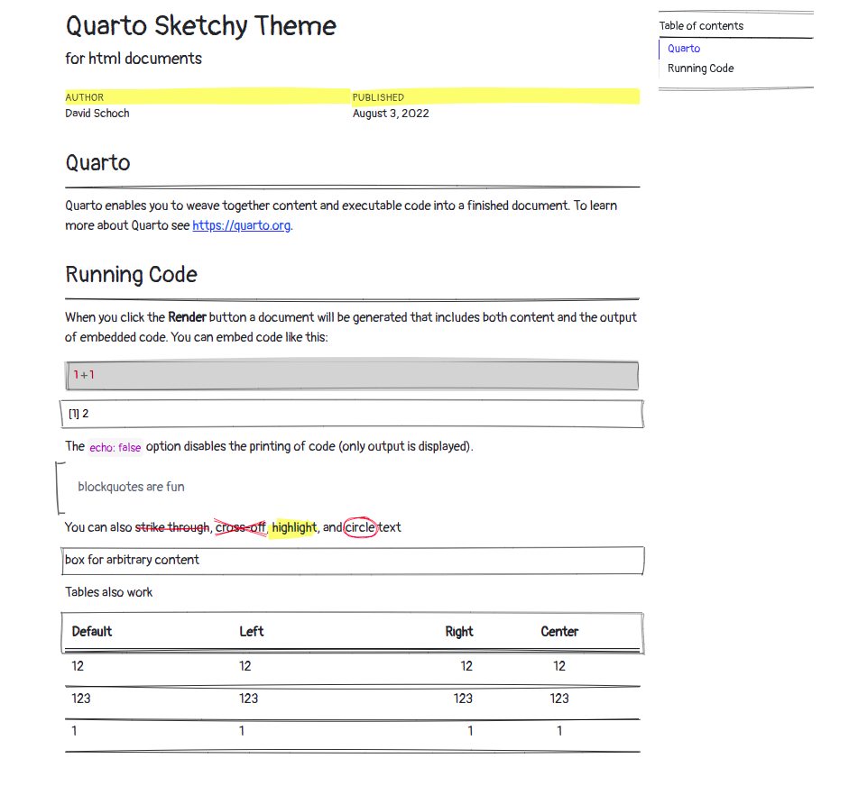

uses [roughnotation](https://roughnotation.com/) to create a sketchy looking html file



*Note that there is already a built in sketchy theme available* ([https://bootswatch.com/sketchy/](https://bootswatch.com/sketchy/))

## Installation

The template can be installed using the following command:

```bash
quarto add schochastics/quarto-sketchy-html
```

Alternatively, you can install and use a template document directly using the following command:

```bash
quarto use template schochastics/quarto-sketchy-html
```

All available classes are shown in the template.

A rendered version of `template.qmd` can be found on [quarto.pub](https://schochastics.quarto.pub/quarto-sketchy-theme/)
